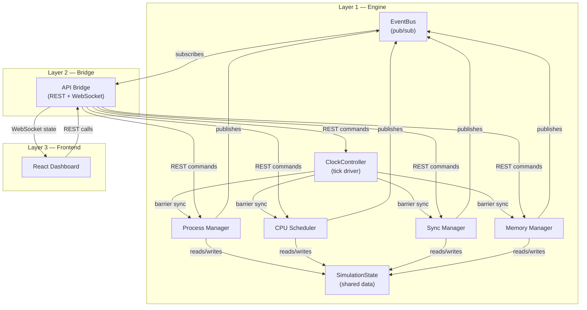

# Mini OS Kernel Simulator — Module Analysis & Build Order

## Architecture Overview

The project is a **3-layer system**: C++ Simulation Engine → API Bridge → React Dashboard.

---

## All Modules Identified

From cross-referencing the PRD, SDD, and Data Dictionary, the project breaks down into **10 distinct modules** across three layers:

### Layer 1 — C++ Simulation Engine (6 modules)

| # | Module | Key Files | Data Structures | Responsibility |
|---|--------|-----------|-----------------|----------------|
| 1 | **Core: SimulationState** | `engine/core/SimulationState.h` | `SimulationState` struct, all enums in `SimEnums.h` | Central shared data store. Holds PCBs, TCBs, queues, page tables, frame tables, semaphores, clock tick, metrics. Protected by `std::shared_mutex`. |
| 2 | **Core: EventBus** | `engine/core/EventBus.h` | `SimEvent` | Pub/sub messaging backbone. 13 event types (PROCESS_CREATED, PAGE_FAULT, TICK_ADVANCED, etc.). Modules publish here, never call each other. |
| 3 | **Core: ClockController** | `engine/core/ClockController.cpp` | — | Drives tick advancement. Manages STEP vs AUTO mode, `std::barrier` synchronisation across module threads, condition variable for step signals. |
| 4 | **Process Manager** | `engine/modules/process/` | `PCB` (17 fields), `TCB` (11 fields), `ProcessSpec` | Process/thread lifecycle: create, terminate, state machine transitions (NEW→READY→RUNNING→WAITING→TERMINATED). |
| 5 | **CPU Scheduler** | `engine/modules/scheduler/` + `policies/` | `GanttEntry`, `SchedulingMetrics` | Ready queue management, policy-based process selection. Strategies: `FCFSPolicy`, `RoundRobinPolicy`, `PriorityPolicy` (preemptive & non-preemptive). |
| 6 | **Sync Manager** | `engine/modules/sync/` | `Mutex` (8 fields), `Semaphore` (9 fields) | Mutex locks, binary and counting semaphores, blocked queues, race condition demonstration. |
| 7 | **Memory Manager** | `engine/modules/memory/` + `policies/` | `PageTableEntry` (7 fields), `PageTable`, `FrameTableEntry` (6 fields), `MemoryMetrics` | Paging, page tables, frame table, page fault handling. Strategies: `FIFOPolicy`, `LRUPolicy`. |

### Layer 2 — API Bridge (1 module)

| # | Module | Key Files | Responsibility |
|---|--------|-----------|----------------|
| 8 | **API Bridge** | `engine/bridge/RestServer.cpp`, `WsServer.cpp`, `WorkloadLoader.h` | REST endpoints (12 routes), WebSocket state broadcaster, JSON serialisation via nlohmann/json. Uses Crow framework. |

### Layer 3 — React Dashboard (1 module, 9 components)

| # | Module | Key Components | Responsibility |
|---|--------|----------------|----------------|
| 9 | **React Dashboard** | `App`, `SimControlBar`, `ProcessPanel`, `SchedulerPanel`, `SyncPanel`, `MemoryPanel`, `DecisionLogPanel`, `MetricsPanel`, `ConceptTooltip`, `WorkloadLauncher` | State-less UI. Connects via WebSocket, renders engine state, sends REST commands. |

### Cross-cutting

| # | Module | Responsibility |
|---|--------|----------------|
| 10 | **Build System & Project Scaffold** | CMake configuration, Vite setup, repo structure, dependency management (Crow, websocketpp, nlohmann/json, Recharts). |

---

## Dependency Graph

---

## Recommended Build Order

> [!IMPORTANT]
> The modules have a clear bottom-up dependency chain. Each phase builds on the previous one. You **must** start with the foundation — no OS module can function without the shared state and event bus.

### Phase 1 — Foundation (Start Here!)
**Build: `SimulationState` + `SimEnums` + `EventBus` + `ISimModule` interface + CMake scaffold**

- Define all 8 enums from the Data Dictionary
- Define the `SimulationState` struct (top-level, all sub-structs stubbed)
- Implement the `EventBus` (publish/subscribe with `std::mutex`)
- Define the `ISimModule` abstract base class (`onTick`, `reset`, `getStatus`, `getModuleName`)
- Set up CMake project with module directories

> [!TIP]
> This phase has **zero dependencies** on anything else. Once done, all four OS modules can be developed **in parallel** by different team members.

---

### Phase 2 — Process Manager (First OS module)
**Build: `PCB`, `TCB`, `ProcessSpec`, Process Manager module**

- Implement `PCB.h` / `TCB.h` with all fields from Data Dictionary
- Implement Process Manager's `onTick()`: state transitions, process creation, thread management
- Unit test: create processes, verify state transitions NEW→READY→TERMINATED

> [!NOTE]
> The Process Manager comes first because **every other module needs processes to exist**. The Scheduler needs processes in the ready queue. The Sync Manager blocks/unblocks processes. The Memory Manager assigns page tables to processes.

---

### Phase 3 — CPU Scheduler (Second OS module)
**Build: `GanttEntry`, `SchedulingMetrics`, Scheduler module + 3 scheduling policies**

- Implement `ISchedulingPolicy` interface
- Implement `FCFSPolicy`, `RoundRobinPolicy`, `PriorityPolicy` (both preemptive & non-preemptive)
- Scheduler's `onTick()`: select from ready queue, decrement burst, manage quantum, log Gantt entries
- Compute metrics: avg waiting time, avg turnaround, CPU utilization
- Unit test: verified against hand-computed textbook examples

---

### Phase 4 — Memory Manager (Third OS module)
**Build: `PageTableEntry`, `PageTable`, `FrameTableEntry`, `MemoryMetrics`, Memory module + 2 policies**

- Implement `IReplacementPolicy` interface
- Implement `FIFOPolicy`, `LRUPolicy`
- Memory Manager's `onTick()`: handle page faults, manage frame table, update page tables
- Unit test: standard page reference strings, verify fault counts match textbook

---

### Phase 5 — Sync Manager (Fourth OS module)
**Build: `Mutex`, `Semaphore`, Sync module, race condition demo**

- Implement mutex with ownership tracking
- Implement binary & counting semaphores
- Sync Manager's `onTick()`: process lock/unlock requests, manage blocked queues
- Build the race condition demonstration scenario (with & without synchronization)
- Unit test: producer-consumer, mutual exclusion verification

---

### Phase 6 — Clock Controller & Integration
**Build: `ClockController`, tick barrier, STEP/AUTO mode, integrate all modules**

- Wire the `std::barrier` to synchronise all 4 module threads per tick
- Implement STEP mode (condition variable wait) and AUTO mode (timer-driven)
- Integration test: all modules running together, events flowing

---

### Phase 7 — API Bridge
**Build: REST endpoints (Crow), WebSocket broadcaster, JSON serialisation**

- 12 REST routes from the SDD
- WebSocket state broadcasting after each tick
- `WorkloadLoader` for prebuilt scenarios (cpu_bound, io_bound, mixed)
- Integration test: curl commands controlling the engine

---

### Phase 8 — React Dashboard
**Build: Vite + React + TypeScript project, all 9 UI components**

- WebSocket connection hook (`useSimState`)
- REST command hook (`useSimControl`)
- `SimControlBar` → `ProcessPanel` → `SchedulerPanel` → `MemoryPanel` → `SyncPanel`
- `DecisionLogPanel`, `MetricsPanel`, `ConceptTooltip`, `WorkloadLauncher`
- Gantt chart, line/bar charts via Recharts

---

### Phase 9 — Polish & Verification
- Side-by-side policy comparison view
- Educational annotations and tooltips
- Cross-browser testing (Chrome + Firefox)
- CEP rubric compliance review
- Performance test: UI updates within 100ms per tick

---

## Team Parallelism Strategy

After **Phase 1** is complete:

| Team Member | Can Work On |
|------------|-------------|
| Member A | Phase 2 (Process Manager) → Phase 3 (Scheduler) |
| Member B | Phase 4 (Memory Manager) → Phase 5 (Sync Manager) |
| Member C | Phase 8 (React Dashboard — start building UI shells with mock data) |

All converge at **Phase 6** for integration.

---

## Summary Stats

| Metric | Count |
|--------|-------|
| Total distinct modules | 10 |
| C++ Engine modules | 7 (3 core + 4 OS) |
| API Bridge modules | 1 |
| Frontend modules | 1 (with 9 components) |
| Data structures to implement | 12 structs |
| Enums to define | 8 |
| REST endpoints | 12 |
| Event types | 13 |
| Strategy interfaces | 2 (scheduling + replacement) |
| Concrete policies | 5 (FCFS, RR, Priority×2, FIFO, LRU) |
