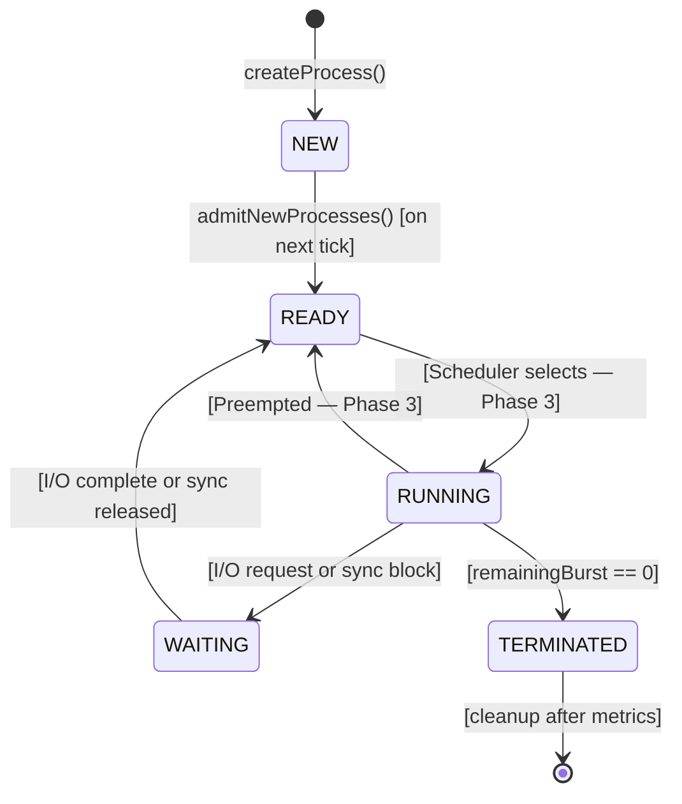

# Phase 2 — Process Manager Module

Implement the first OS subsystem module: the **Process Manager**. This module owns the lifecycle of all processes and threads in the simulation. It is the foundational OS module — every other module (Scheduler, Memory Manager, Sync Manager) depends on processes existing in the system.

## Phase 1 Status (What Already Exists)

The following Phase 1 components are complete and compiling:

| Component | File | Status |
|-----------|------|--------|
| All 8 enums | [SimEnums.h](file:///d:/study/Semester%204%20Spring%202026/Operating%20System/CEP/os-simulator/engine/core/SimEnums.h) | ✅ Done |
| SimulationState | [SimulationState.h](file:///d:/study/Semester%204%20Spring%202026/Operating%20System/CEP/os-simulator/engine/core/SimulationState.h) | ✅ Done |
| EventBus | [EventBus.h](file:///d:/study/Semester%204%20Spring%202026/Operating%20System/CEP/os-simulator/engine/core/EventBus.h) / [.cpp](file:///d:/study/Semester%204%20Spring%202026/Operating%20System/CEP/os-simulator/engine/core/EventBus.cpp) | ✅ Done |
| ClockController | [ClockController.h](file:///d:/study/Semester%204%20Spring%202026/Operating%20System/CEP/os-simulator/engine/core/ClockController.h) / [.cpp](file:///d:/study/Semester%204%20Spring%202026/Operating%20System/CEP/os-simulator/engine/core/ClockController.cpp) | ✅ Done |
| ISimModule | [ISimModule.h](file:///d:/study/Semester%204%20Spring%202026/Operating%20System/CEP/os-simulator/engine/core/ISimModule.h) | ✅ Done |
| PCB struct | [PCB.h](file:///d:/study/Semester%204%20Spring%202026/Operating%20System/CEP/os-simulator/engine/modules/process/PCB.h) | ✅ Done |
| TCB struct | [TCB.h](file:///d:/study/Semester%204%20Spring%202026/Operating%20System/CEP/os-simulator/engine/modules/process/TCB.h) | ✅ Done |
| SimEvent + EventTypes | [SimEvent.h](file:///d:/study/Semester%204%20Spring%202026/Operating%20System/CEP/os-simulator/engine/core/SimEvent.h) | ✅ Done |
| CMake build system | [CMakeLists.txt](file:///d:/study/Semester%204%20Spring%202026/Operating%20System/CEP/os-simulator/CMakeLists.txt) | ✅ Done |
| Unit tests (State + EventBus) | `tests/` | ✅ Done |

> [!IMPORTANT]
> PCB.h and TCB.h already exist as **data-only structs** from Phase 1. Phase 2 does NOT re-create them — it builds the **ProcessManager class** that *operates* on these structs.

---

## Proposed Changes

### Component 1 — ProcessSpec Data Structure

The `ProcessSpec` struct is the payload received when a user creates a process via REST or the workload loader. It is defined in the Data Dictionary §8.2.

#### [NEW] [ProcessSpec.h](file:///d:/study/Semester%204%20Spring%202026/Operating%20System/CEP/os-simulator/engine/modules/process/ProcessSpec.h)

```cpp
// engine/modules/process/ProcessSpec.h
#pragma once

#include <string>
#include <cstdint>
#include "core/SimEnums.h"

struct ProcessSpec {
    std::string   name;               // Optional user-supplied name (empty = auto "proc_N")
    ProcessType   type;               // CPU_BOUND | IO_BOUND | MIXED
    int           priority;           // 1 (highest) to 10 (lowest)
    uint32_t      cpuBurst;           // Total CPU ticks (0 = auto-assign)
    uint32_t      ioBurstDuration;    // I/O burst duration (0 = no I/O or auto)
    uint32_t      memoryRequirement;  // Virtual pages needed (0 = auto-assign)

    ProcessSpec()
        : name(""), type(ProcessType::CPU_BOUND), priority(5),
          cpuBurst(0), ioBurstDuration(0), memoryRequirement(0) {}
};
```

> [!NOTE]
> **Auto-assignment logic**: When `cpuBurst == 0`, the ProcessManager auto-assigns based on process type:
> - `CPU_BOUND`: random 8–20 ticks
> - `IO_BOUND`: random 2–6 ticks
> - `MIXED`: random 4–12 ticks
>
> Similarly for `ioBurstDuration` (0 for CPU_BOUND, 3–8 for IO_BOUND, 2–5 for MIXED) and `memoryRequirement` (2–4 pages default).

---

### Component 2 — ProcessManager Class (Core Implementation)

This is the main deliverable of Phase 2. The `ProcessManager` implements `ISimModule` and manages the entire process/thread lifecycle.

#### [NEW] [ProcessManager.h](file:///d:/study/Semester%204%20Spring%202026/Operating%20System/CEP/os-simulator/engine/modules/process/ProcessManager.h)

**Public interface:**

```cpp
class ProcessManager : public ISimModule {
public:
    ProcessManager();

    // ── ISimModule interface ────────────────────────────────
    void        onTick(SimulationState& state, EventBus& bus) override;
    void        reset() override;
    ModuleStatus getStatus() const override;
    std::string  getModuleName() const override;  // Returns "ProcessManager"

    // ── Process lifecycle API (called by API Bridge in Phase 7) ──
    int  createProcess(SimulationState& state, EventBus& bus,
                       const ProcessSpec& spec);
    void killProcess(SimulationState& state, EventBus& bus, int pid);

    // ── Thread lifecycle API ────────────────────────────────
    int  createThread(SimulationState& state, EventBus& bus,
                      int parentPid, uint32_t cpuBurst = 1,
                      uint32_t stackSize = 2);

private:
    ModuleStatus status_;

    // ── Internal helpers ────────────────────────────────────
    void admitNewProcesses(SimulationState& state, EventBus& bus);
    void handleIOCompletions(SimulationState& state, EventBus& bus);
    void updateWaitingTimes(SimulationState& state);
    void cleanupTerminated(SimulationState& state);
    uint32_t autoAssignBurst(ProcessType type);
    uint32_t autoAssignIO(ProcessType type);
    uint32_t autoAssignMemory(ProcessType type);
    std::string autoGenerateName(int pid);
};
```

#### [NEW] [ProcessManager.cpp](file:///d:/study/Semester%204%20Spring%202026/Operating%20System/CEP/os-simulator/engine/modules/process/ProcessManager.cpp)

**`onTick()` — the core per-tick logic (called every clock tick by ClockController):**

```
onTick(state, bus):
    1. admitNewProcesses(state, bus)
       - For each process in state.processTable where state == NEW:
         - Transition to READY
         - Add PID to state.readyQueue
         - Set pageTableId = pid
         - Publish PROCESS_STATE_CHANGED event
         - Log decision: "Process {name} (PID {pid}) admitted to ready queue"

    2. handleIOCompletions(state, bus)
       - For each process where state == WAITING and ioRemainingTicks > 0:
         - Decrement ioRemainingTicks
         - If ioRemainingTicks reaches 0:
           - Transition to READY
           - Add PID to back of state.readyQueue
           - Reset ioCompletionTick = 0
           - Publish PROCESS_STATE_CHANGED event
           - Log decision: "Process {name} (PID {pid}) I/O complete, moved to READY"

    3. updateWaitingTimes(state)
       - For each process where state == READY:
         - Increment waitingTime by 1

    4. cleanupTerminated(state)
       - For processes in TERMINATED state for more than 5 ticks:
         - Compute turnaroundTime = terminationTick - arrivalTick
         - (Optionally) remove from processTable after metrics collected

    5. Set status_ = ACTIVE
```

**`createProcess()` — invoked externally via API or workload loader:**

```
createProcess(state, bus, spec):
    1. Assign pid = state.nextPID++
    2. Build PCB:
       - pid, name (auto-generate if empty), type, priority
       - state = ProcessState::NEW
       - arrivalTick = state.currentTick
       - totalCpuBurst = spec.cpuBurst (or autoAssign)
       - remainingBurst = totalCpuBurst
       - ioBurstDuration = spec.ioBurstDuration (or autoAssign)
       - memoryRequirement = spec.memoryRequirement (or autoAssign)
       - pageTableId = -1 (assigned on admission)
       - All metric fields = 0
    3. Insert into state.processTable[pid]
    4. Publish PROCESS_CREATED event
    5. Log decision: "Process {name} (PID {pid}) created with burst={burst}, priority={priority}"
    6. Return pid
```

**`killProcess()` — force-terminate a process:**

```
killProcess(state, bus, pid):
    1. Find PCB in state.processTable
    2. If not found or already TERMINATED, return
    3. Set state = TERMINATED
    4. Set terminationTick = state.currentTick
    5. Compute turnaroundTime
    6. Remove from readyQueue (if present)
    7. If runningPID == pid: set runningPID = -1
    8. Terminate all child threads (set T_TERMINATED)
    9. Publish PROCESS_TERMINATED event
    10. Log decision
```

**`createThread()` — create a thread within a process:**

```
createThread(state, bus, parentPid, cpuBurst, stackSize):
    1. Validate parentPid exists and is not TERMINATED
    2. Assign tid = state.nextTID++
    3. Build TCB:
       - tid, parentPid
       - state = T_NEW
       - creationTick = state.currentTick
       - stackSize, cpuBurst, remainingBurst = cpuBurst
       - simulatedSP = 0, blockedOnSyncId = -1, waitingTime = 0
    4. Insert into state.threadTable[tid]
    5. Add tid to parent PCB's threadIds
    6. Return tid
```

---

### Process State Machine

The Process Manager enforces the following state transitions (from PRD §FR-PM-01 and Data Dictionary §2.1):



> [!IMPORTANT]
> **Phase 2 vs Phase 3 boundary**: The Process Manager does NOT own the READY→RUNNING transition. That is the Scheduler's job (Phase 3). The Process Manager only handles:
> - `NEW → READY` (admission)
> - `WAITING → READY` (I/O completion)
> - `* → TERMINATED` (kill)
> - Waiting time accumulation for processes in READY state
>
> The `RUNNING → WAITING` transition will be triggered by the Scheduler when a running process initiates I/O. In Phase 2, we stub this by allowing `killProcess()` and I/O handling, but the full RUNNING-side transitions come in Phase 3.

---

### Component 3 — Build System Updates

#### [MODIFY] [CMakeLists.txt](file:///d:/study/Semester%204%20Spring%202026/Operating%20System/CEP/os-simulator/engine/CMakeLists.txt)

Add the `process_manager_lib` library:

```cmake
# ── Process Manager Library ──────────────────────────────────
add_library(process_manager_lib
    modules/process/ProcessManager.cpp
)
target_include_directories(process_manager_lib PUBLIC ${ENGINE_INCLUDE_DIR})
target_link_libraries(process_manager_lib PUBLIC core_lib)
```

Link it to the main executable:

```diff
-target_link_libraries(os_simulator PRIVATE core_lib)
+target_link_libraries(os_simulator PRIVATE core_lib process_manager_lib)
```

#### [MODIFY] [CMakeLists.txt](file:///d:/study/Semester%204%20Spring%202026/Operating%20System/CEP/os-simulator/tests/CMakeLists.txt)

Add a new test target:

```cmake
# ── Test: ProcessManager ─────────────────────────────────────
add_executable(test_process_manager test_process_manager.cpp)
target_include_directories(test_process_manager PRIVATE ${ENGINE_INCLUDE_DIR})
target_link_libraries(test_process_manager
    PRIVATE
    GTest::gtest_main
    core_lib
    process_manager_lib
)
add_test(NAME ProcessManagerTests COMMAND test_process_manager)
```

---

### Component 4 — Integration with main.cpp

#### [MODIFY] [main.cpp](file:///d:/study/Semester%204%20Spring%202026/Operating%20System/CEP/os-simulator/engine/main.cpp)

Update main.cpp to register the ProcessManager with the ClockController and demonstrate a basic process lifecycle:

```cpp
#include "modules/process/ProcessManager.h"
#include "modules/process/ProcessSpec.h"

// In main():
auto procMgr = std::make_shared<ProcessManager>();
clock.registerModule(procMgr);

// Create a test process
ProcessSpec spec;
spec.name = "test_proc";
spec.type = ProcessType::CPU_BOUND;
spec.priority = 3;
spec.cpuBurst = 10;
spec.memoryRequirement = 2;

int pid = procMgr->createProcess(state, bus, spec);

// Step a few ticks to see admission
clock.start();
clock.stepOnce();  // NEW -> READY
clock.stepOnce();  // In ready queue, waiting time++

std::cout << "Process state: " << toString(state.processTable[pid].state) << std::endl;
std::cout << "Ready queue size: " << state.readyQueue.size() << std::endl;
```

---

### Component 5 — Unit Test Suite

#### [NEW] [test_process_manager.cpp](file:///d:/study/Semester%204%20Spring%202026/Operating%20System/CEP/os-simulator/tests/test_process_manager.cpp)

The test file will contain the following test cases organised into Google Test fixtures:

**Test Fixture: `ProcessManagerTest`**
- Provides a fresh `SimulationState`, `EventBus`, and `ProcessManager` for each test

**Test Group 1 — Module Interface**
| Test | What It Verifies |
|------|-----------------|
| `ModuleName` | `getModuleName()` returns `"ProcessManager"` |
| `InitialStatus` | `getStatus()` returns `IDLE` before any tick |
| `StatusAfterTick` | `getStatus()` returns `ACTIVE` after `onTick()` is called |
| `ResetClearsStatus` | After `reset()`, status goes back to `IDLE` |

**Test Group 2 — Process Creation**
| Test | What It Verifies |
|------|-----------------|
| `CreateSingleProcess` | PCB inserted into `processTable` with correct fields |
| `PIDAutoIncrement` | Sequential PIDs: 1, 2, 3... |
| `AutoName` | Empty name generates `"proc_1"`, `"proc_2"`, etc. |
| `CustomName` | User-supplied name is preserved |
| `AutoAssignBurst_CPUBound` | `cpuBurst=0` on CPU_BOUND gives burst in [8, 20] |
| `AutoAssignBurst_IOBound` | `cpuBurst=0` on IO_BOUND gives burst in [2, 6] |
| `AutoAssignIO_CPUBound` | CPU_BOUND gets `ioBurstDuration=0` |
| `AutoAssignMemory` | `memoryRequirement=0` gets auto-assigned > 0 |
| `InitialState_NEW` | Created process is in `ProcessState::NEW` |
| `ArrivalTick` | `arrivalTick == state.currentTick` at creation time |
| `CreationEvent` | `PROCESS_CREATED` event is published |

**Test Group 3 — State Transitions (NEW → READY)**
| Test | What It Verifies |
|------|-----------------|
| `AdmitOnTick` | After one `onTick()`, NEW process becomes READY |
| `AddedToReadyQueue` | Admitted process PID appears in `state.readyQueue` |
| `MultipleAdmit` | 3 NEW processes all admitted to READY in one tick |
| `PageTableIdAssigned` | `pageTableId` is set (= pid) after admission |
| `StateChangeEvent` | `PROCESS_STATE_CHANGED` event published on admission |
| `DecisionLog` | Decision log contains admission entry |

**Test Group 4 — I/O Completion (WAITING → READY)**
| Test | What It Verifies |
|------|-----------------|
| `IOCountdown` | `ioRemainingTicks` decrements each tick when WAITING |
| `IOComplete` | When `ioRemainingTicks` hits 0, process moves to READY |
| `IOComplete_ReadyQueue` | Completed process re-enters back of `readyQueue` |
| `IOComplete_ResetFields` | `ioCompletionTick` reset to 0 after I/O done |

**Test Group 5 — Kill Process**
| Test | What It Verifies |
|------|-----------------|
| `KillRunningProcess` | Running process → TERMINATED, `runningPID` set to -1 |
| `KillReadyProcess` | Ready process → TERMINATED, removed from `readyQueue` |
| `KillSetsTerminationTick` | `terminationTick == currentTick` |
| `KillComputesTurnaround` | `turnaroundTime == terminationTick - arrivalTick` |
| `KillTerminatesThreads` | All child threads set to `T_TERMINATED` |
| `KillPublishesEvent` | `PROCESS_TERMINATED` event published |
| `KillNonexistent` | Killing non-existent PID does nothing (no crash) |
| `KillAlreadyTerminated` | Killing TERMINATED process does nothing |

**Test Group 6 — Thread Management**
| Test | What It Verifies |
|------|-----------------|
| `CreateThread` | TCB inserted with correct fields |
| `TIDAutoIncrement` | Sequential TIDs: 1, 2, 3... |
| `ThreadLinkedToParent` | Parent PCB's `threadIds` contains the new TID |
| `ThreadInitialState` | Created thread is in `T_NEW` |
| `CreateThreadInvalidParent` | Creating thread for non-existent PID fails gracefully |

**Test Group 7 — Waiting Time Accumulation**
| Test | What It Verifies |
|------|-----------------|
| `WaitingTimeIncrements` | Process in READY state gains +1 `waitingTime` per tick |
| `WaitingTimeNotInRunning` | Process in RUNNING doesn't accumulate `waitingTime` |
| `WaitingTimeMultiple` | Multiple READY processes all accumulate independently |

**Test Group 8 — Edge Cases**
| Test | What It Verifies |
|------|-----------------|
| `NoProcessesNoError` | `onTick()` with empty `processTable` runs without error |
| `MaxPriority` | Process with priority=1 is created correctly |
| `MinPriority` | Process with priority=10 is created correctly |
| `ZeroBurstAutoAssign` | `cpuBurst=0` triggers auto-assignment, result ≥ 1 |

---

## File Summary

| Action | File | Description |
|--------|------|-------------|
| **NEW** | `engine/modules/process/ProcessSpec.h` | ProcessSpec data structure (REST payload) |
| **NEW** | `engine/modules/process/ProcessManager.h` | ProcessManager class declaration |
| **NEW** | `engine/modules/process/ProcessManager.cpp` | ProcessManager implementation (~200–250 lines) |
| **NEW** | `tests/test_process_manager.cpp` | Unit tests (~350–400 lines, 30+ test cases) |
| **MODIFY** | `engine/CMakeLists.txt` | Add `process_manager_lib`, link to executable |
| **MODIFY** | `tests/CMakeLists.txt` | Add `test_process_manager` target |
| **MODIFY** | `engine/main.cpp` | Register ProcessManager, demo lifecycle |

---

## Open Questions

> [!IMPORTANT]
> **I/O initiation in Phase 2**: The Data Dictionary shows processes can go RUNNING → WAITING when they need I/O. However, the full RUNNING → WAITING transition logically belongs to the **Scheduler** (Phase 3), since only the Scheduler knows which process is RUNNING. In Phase 2, should I:
> - **(A)** Only implement the ProcessManager's side — `handleIOCompletions()` (WAITING → READY) — and defer RUNNING → WAITING to Phase 3?
> - **(B)** Add a `requestIO(pid)` method to ProcessManager now that can be called to simulate RUNNING → WAITING, even before the Scheduler exists?
>
> **Recommendation**: Option A is cleaner — Phase 2 handles creation, admission, I/O completion, kill, and waiting time. The Scheduler in Phase 3 will call into ProcessManager to trigger the I/O transition when a running process's CPU burst reaches an I/O interval.

> [!NOTE]
> **Terminated process cleanup**: The Data Dictionary says "PCB is retained for metrics collection then removed." Should terminated processes be cleaned up after a fixed number of ticks (e.g., 5) or should they persist until the simulation is reset? The current plan uses 5-tick retention, but this is configurable.

---

## Verification Plan

### Automated Tests

1. **Build the project**:
   ```powershell
   cd d:\study\Semester 4 Spring 2026\Operating System\CEP\os-simulator
   cmake -B build -G "MinGW Makefiles"
   cmake --build build
   ```

2. **Run all tests** (existing Phase 1 + new Phase 2):
   ```powershell
   cd build
   ctest --output-on-failure
   ```

3. **Expected results**: All 30+ ProcessManager tests pass, plus the existing SimulationState and EventBus tests continue to pass (no regressions).

4. **Run the executable** to verify the demo lifecycle:
   ```powershell
   .\build\os_simulator.exe
   ```
   Expected output should show a process being created, admitted to READY, and the ready queue having one entry.

### Manual Verification

- Inspect that `state.processTable` contains the PCB with all correct field values
- Verify `state.readyQueue` contains PIDs in the correct order
- Verify events are visible in `bus.getTickEvents()` output
- Confirm no compiler warnings on build with `/W4` (MSVC) or `-Wall -Wextra` (GCC/Clang)
