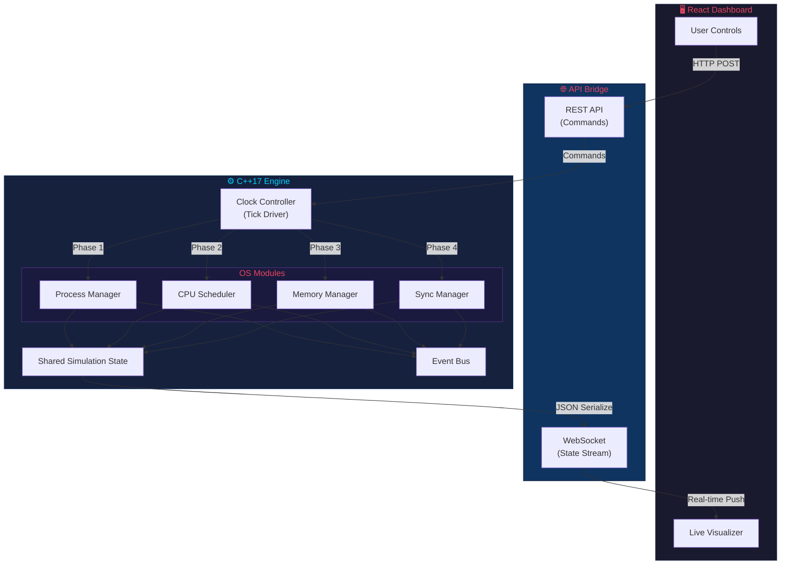
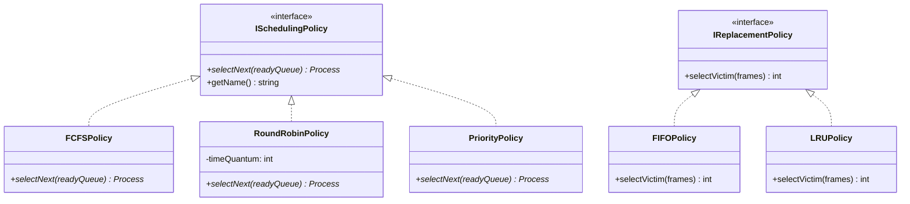

<p align="center">
  
</p>

<h1 align="center">MiniOS Kernel Simulator</h1>

<p align="center">
  <em>See your OS come alive. Tick by tick.</em>
</p>

<p align="center">
  
  
  
  
  
  
</p>

---

## 🧠 What Is This?

**MiniOS** is a fully interactive, browser-based operating system kernel simulator built from the ground up with a **multithreaded C++17 engine** and a **real-time React dashboard**. It doesn't just *describe* OS concepts — it **runs them live**, tick by tick, and lets you *see* every scheduling decision, every page fault, every race condition as it happens.

Built as a Complex Engineering Problem (CEP) for CS-330 Operating Systems at FAST-NUCES, this project goes far beyond a university assignment — it's a complete **OS learning platform** that any student can use to finally *understand* what their textbook is trying to say.

---

## ✨ Feature Highlights

| Module | What It Does | Algorithms |
|--------|-------------|------------|
| 🔄 **Process Manager** | Full PCB lifecycle with 5-state machine (New → Ready → Running → Waiting → Terminated) | Manual injection + prebuilt workloads |
| ⚡ **CPU Scheduler** | Real-time scheduling with live Gantt chart, wait time, turnaround time & CPU utilization | FCFS · Round Robin · Priority |
| 🧲 **Sync Manager** | Mutex & semaphore primitives with blocked queue visualization | Race condition demo (with & without protection) |
| 📦 **Memory Manager** | Paging-based virtual memory with per-process page tables & fault tracking | FIFO · LRU (hot-swappable mid-simulation) |
| 🕐 **Clock Controller** | Tick-driven phased execution engine with step & auto modes | Configurable speed slider |
| 🌐 **REST + WebSocket** | Full API bridge — control simulation via HTTP, stream state via WebSocket | Crow C++ web server |
| 🖥️ **React Dashboard** | Live visualization of every OS internal with educational annotations | Vite + TypeScript |

---

## 🖥️ System Architecture



---

## 🎯 What You Can Do

| Action | How | What You'll See |
|--------|-----|----------------|
| 🚀 Load a workload | Pick CPU-bound, I/O-bound, or Mixed | Processes spawn with realistic burst profiles |
| 🔀 Swap scheduler live | Click FCFS → RR → Priority mid-run | Gantt chart reacts instantly, metrics recalculate |
| 🧠 Compare page policies | Toggle FIFO ↔ LRU while simulation runs | Page fault counter shows the difference in real-time |
| 🏎️ Race condition demo | Click "Run Sync Demo" | Watch shared data corrupt, then fix it with a mutex |
| ⏱️ Step mode | Advance one tick at a time | See every scheduling decision explained in the decision log |
| 🎚️ Speed control | Drag the speed slider | Slow-motion to full-speed simulation |

---

## ⚡ Quick Start

> **Prerequisites:** CMake 3.20+, C++17 compiler (MSVC/GCC/Clang), Node.js 18+

### 1️⃣ Clone & Build the Engine

```bash
git clone https://github.com/Lord-Saruman/OS-Kernel-Learning-Simulation.git
cd OS-Kernel-Learning-Simulation/os-simulator

mkdir build && cd build
cmake ..
cmake --build . --config Release
```

### 2️⃣ Start the Engine

```bash
# The engine starts a REST + WebSocket server on port 8080
./engine/Release/os_simulator.exe
```

### 3️⃣ Launch the Dashboard

```bash
# In a new terminal
cd os-simulator/dashboard
npm install
npm run dev
```

### 4️⃣ Open Your Browser

Navigate to **[http://localhost:5173](http://localhost:5173)** — and watch your OS come alive 🔥

---

## 🔬 Under the Hood

<details>
<summary><strong>🕐 Tick-Driven Phased Execution</strong></summary>

<br/>

Every clock tick executes the OS modules in a deterministic pipeline:


Each module reads from and writes to a **shared `SimulationState`** object. Modules never call each other directly — they communicate through the state and an **Event Bus**, ensuring true modularity.

</details>

<details>
<summary><strong>🧩 Strategy Pattern — Swap Algorithms Without Touching Core Code</strong></summary>

<br/>

Every OS policy is a pluggable strategy:



**Want to add a new algorithm?** Implement the interface, register it, done. Zero changes to other modules.

</details>

<details>
<summary><strong>🔒 Concurrency Model — Real Threads, Real Synchronization</strong></summary>

<br/>

The C++ engine uses **real OS threads** with barrier-based synchronization:

- The **Clock Controller** drives the simulation loop on its own thread
- Each tick uses a **`std::barrier`** to synchronize module execution
- The **REST server** runs on a separate thread, accepting commands asynchronously
- The **WebSocket** pushes state updates without blocking the simulation
- All shared state access is protected by **`std::mutex`** and **`std::lock_guard`**

No data races. No undefined behavior. Verified with thread sanitizers.

</details>

---

## 🧪 Testing Pyramid

```
         ╔═══════════════════════════╗
         ║   🖥️  Manual Frontend     ║  ← Visual verification matrix
         ║      Verification         ║    (all policy combos tested)
         ╠═══════════════════════════╣
         ║   🌐  API Integration     ║  ← 39 assertions via PowerShell
         ║      Tests (REST)         ║    (incl. textbook FIFO/LRU proof)
         ╠═══════════════════════════╣
         ║   ⚙️  Engine Unit Tests   ║  ← 9 Google Test suites
         ║      (Google Test)        ║    (process, scheduler, memory,
         ║                           ║     sync, clock, event bus,
         ╚═══════════════════════════╝     integration, state, compare)
```

| Layer | Framework | Count | What It Verifies |
|-------|-----------|-------|-----------------|
| **Engine** | Google Test | 9 suites | Every module in isolation + integration |
| **API** | PowerShell | 39 assertions | Full REST workflow including textbook reference strings |
| **Frontend** | Manual matrix | All combos | Visual correctness across scheduler × memory × workload |

> 📘 Full test catalogue with expected values and textbook proofs lives in [`TESTING.md`](os-simulator/tests/TESTING.md)

---

## 📊 OS Concepts Covered

| Concept | Implementation | Textbook Reference |
|---------|---------------|-------------------|
| ✅ Process Lifecycle (5 states) | PCB with state machine | Silberschatz Ch. 3 |
| ✅ FCFS Scheduling | Non-preemptive, arrival order | Silberschatz Ch. 5 |
| ✅ Round Robin | Configurable time quantum | Silberschatz Ch. 5 |
| ✅ Priority Scheduling | Preemptive | Silberschatz Ch. 5 |
| ✅ Paging / Virtual Memory | Page tables, frame allocation | Silberschatz Ch. 9 |
| ✅ FIFO Page Replacement | Oldest-page eviction | Silberschatz Ch. 10 |
| ✅ LRU Page Replacement | Least-recently-used eviction | Silberschatz Ch. 10 |
| ✅ Belady's Anomaly | Demonstrated in test suite | Silberschatz Ch. 10 |
| ✅ Mutex Locks | Binary lock with ownership | Silberschatz Ch. 6 |
| ✅ Semaphores | Counting semaphore | Silberschatz Ch. 6 |
| ✅ Race Conditions | Live demo with/without sync | Silberschatz Ch. 6 |
| ✅ CPU Utilization Metrics | Wait time, turnaround, utilization | Silberschatz Ch. 5 |

---

## 🏗️ Project Structure

```
OS-Kernel-Learning-Simulation/
├── 📄 README.md
├── 📄 CONTRIBUTING.md
├── 📄 PRD_MiniOS_Simulator.md          # Product Requirements Document
├── 📄 SDD_MiniOS_Simulator.md          # System Design Document
├── 📄 DataDictionary_MiniOS_Simulator.md
├── 📁 assets/
│   └── 🖼️ banner.png                   # Hero banner
│
└── 📁 os-simulator/
    ├── 📄 CMakeLists.txt                # Root build config
    │
    ├── 📁 engine/                       # ⚙️ C++17 Simulation Engine
    │   ├── 📄 main.cpp                  # Entry point + bootstrap
    │   ├── 📁 core/                     # Simulation infrastructure
    │   │   ├── ClockController.h/cpp    # Tick-driven execution loop
    │   │   ├── SimulationState.h        # Shared state object
    │   │   ├── EventBus.h/cpp           # Pub-sub event system
    │   │   ├── ISimModule.h             # Module interface
    │   │   └── SimEnums.h               # All enumerations
    │   ├── 📁 modules/                  # OS subsystem implementations
    │   │   ├── 📁 process/              # Process Manager (PCB, states)
    │   │   ├── 📁 scheduler/            # CPU Scheduler (FCFS, RR, Priority)
    │   │   ├── 📁 memory/               # Memory Manager (FIFO, LRU paging)
    │   │   └── 📁 sync/                 # Sync Manager (mutex, semaphore)
    │   └── 📁 bridge/                   # API layer
    │       ├── RestServer.h/cpp         # Crow REST + WebSocket server
    │       ├── StateSerializer.h        # JSON serialization
    │       └── WorkloadLoader.h         # Prebuilt workload scenarios
    │
    ├── 📁 dashboard/                    # 🖥️ React Frontend
    │   ├── 📄 package.json
    │   ├── 📄 vite.config.ts
    │   └── 📁 src/
    │       ├── App.tsx                  # Main app + WebSocket wiring
    │       ├── 📁 components/           # UI panels (Gantt, memory, sync...)
    │       ├── 📁 hooks/                # Custom React hooks
    │       └── 📁 types/                # TypeScript type definitions
    │
    └── 📁 tests/                        # 🧪 Test Suite
        ├── 📄 TESTING.md                # Full test catalogue + proofs
        ├── 📄 CMakeLists.txt            # Test build config
        ├── test_process_manager.cpp
        ├── test_scheduler.cpp
        ├── test_memory_manager.cpp
        ├── test_memory_compare.cpp      # Textbook FIFO vs LRU proofs
        ├── test_sync_manager.cpp
        ├── test_clock_controller.cpp
        ├── test_event_bus.cpp
        ├── test_engine_integration.cpp
        ├── test_simulation_state.cpp
        └── 📁 api/                      # REST API integration tests
            └── test_api_workflows.ps1   # 39-assertion PowerShell suite
```

---

## 🤝 Contributing

We welcome contributions! Whether it's a new scheduling algorithm, a UI improvement, or a bug fix — check out our [**Contributing Guide**](CONTRIBUTING.md) to get started.

The Strategy Pattern architecture means you can add new algorithms with **zero changes** to existing modules.

---

## 📜 License

This project is licensed under the **GNU General Public License v3.0** — see the [LICENSE](LICENSE) file for details.

---

## 👤 Author

<table>
  <tr>
    <td>
      <strong>Ameer</strong><br/>
      <a href="https://github.com/Lord-Saruman">@Lord-Saruman</a>
    </td>
  </tr>
</table>

---

<p align="center">
  <strong>⭐ If this helped you understand OS concepts, drop a star!</strong><br/>
  <em>Every star tells a student: "this tool is worth your time."</em>
</p>
